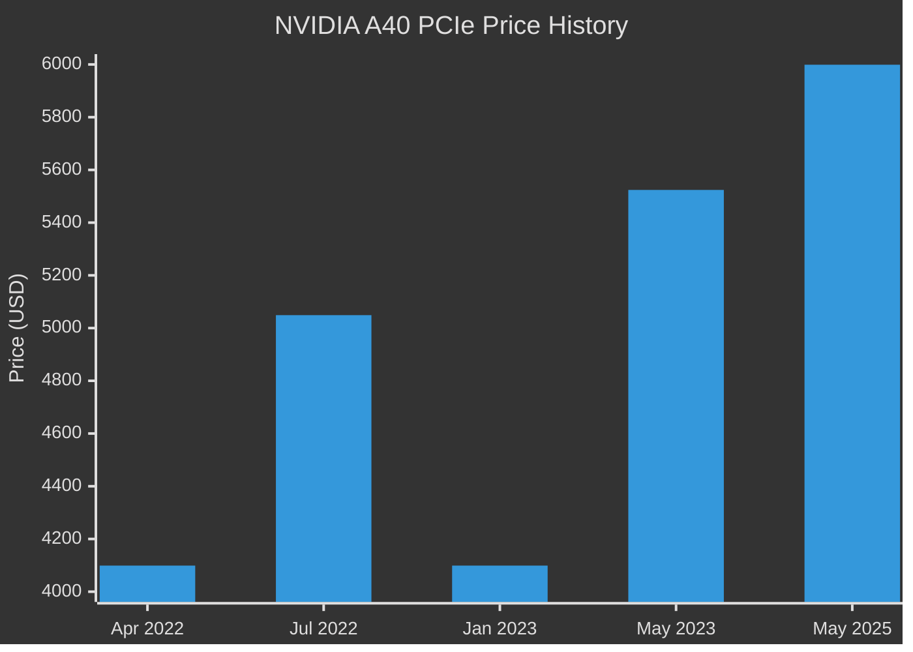

# Keepa Price Tracker

This script fetches pricing history for Amazon products using the Keepa API.

## Features

- Retrieves historical price data for a specific Amazon product
- Converts Keepa's time format to standard datetime
- Exports price history to CSV
- Generates a price history chart

## Requirements

```
requests
pandas
matplotlib
```

## Installation

1. Clone this repository
2. Install the required packages:

```bash
pip install requests pandas matplotlib
```

## Usage

1. Update the `ASIN` variable in `keepa_price_tracker.py` with your desired Amazon product ID
2. Run the script:

```bash
python keepa_price_tracker.py
```

3. The script will generate:
   - A CSV file with price history data
   - A PNG chart showing price trends

## API Documentation

For more details on Keepa API parameters, visit the [Keepa API documentation](https://keepa.com/#!discuss/t/product-request/116).

## Todos

what do i need to do now here next? go through all the feedback ive got and then implent this

- full screen -
- used price column
    - i mean i could pull the used price data from amazon i guess, which would be the easiest solution for now 
- take amazon affiliate links
- fix the graph on mobile (what are the white dots?) 
- add a cross for closing the mobile menu - 
- add a computer configurator page for sh computer similar to the page which brainy has i guess
    - i think this page is really important when i want to make sales 

why are i am so fucking tired - this is super annoying, i feel like i just want to do some reading buy not


# GPU Price Tracker API

Track current prices, specifications, and historical trends for popular GPUs.

## Available GPU Data

| GPU Model | Current Price | VRAM | FP16 TFLOPS | TDP | Release Date |
|-----------|-------------:|-----:|------------:|----:|--------------|
| NVIDIA A100 40GB PCIe | $7,999.99 | 40 GB | 77.97 | 250W | Jun 22, 2020 |
| NVIDIA A40 PCIe | $5,999.00 | 48 GB | 37.42 | 300W | Oct 5, 2020 |
| NVIDIA GeForce RTX 3070 | $549.00 | 8 GB | 20.31 | 220W | Sep 1, 2020 |
| NVIDIA GeForce RTX 3090 | $1,699.99 | 24 GB | 35.58 | 350W | Sep 1, 2020 |
| NVIDIA GeForce RTX 3090 Ti | $1,999.99 | 24 GB | 40.00 | 450W | Jan 27, 2022 |
| NVIDIA GeForce RTX 4060 Ti | $699.00 | 8 GB | 22.06 | 160W | May 13, 2023 |
| NVIDIA GeForce RTX 4070 | $1,299.99 | 12 GB | 29.15 | 200W | Apr 12, 2023 |
| NVIDIA GeForce RTX 4090 | $3,450.99 | 24 GB | 82.58 | 450W | Sep 20, 2022 |


## Option 2: Sparklines

Some Markdown renderers (including GitHub) support emoji and special characters, so you can use them to create simple sparklines:


Screenshot 20250504 at 7.09.23 PM.png
i have this website and would like to make it available as an api. what do you think what makes sense to do if i want to make this available as an api

I'd be happy to help you think through creating an API for your GPU price tracker website. Based on the image, you have a comprehensive table showing GPU information including price, specifications, and historical trends.

Here's what would make sense for transforming this into an API:

Core API Functionality
RESTful Endpoints: Create standard endpoints for retrieving GPU data:
/gpus - Get all GPUs
/gpus/{id} - Get specific GPU by ID
/gpus/search - Search GPUs by parameters
Search Parameters: Support query parameters that match your UI functionality:
Name filtering
Price range filtering
Specification filtering (VRAM, TFLOPS, etc.)
Historical Price Data: Create endpoints specifically for the price history data shown in those charts:
/gpus/{id}/pricehistory - Get price history for a specific GPU
Optional parameters for timeframes (last 30 days, 90 days, etc.)
Data Format: JSON response format with well-structured objects representing each GPU:
json
{
  "id": "nvidia-a100-40gb",
  "name": "NVIDIA A100 40GB PCIe",
  "current_price": 7999.99,
  "fp16_tflops": 77.97,
  "watt": 250,
  "tflops_per_dollar": 0.010,
  "tflops_per_watt": 0.30,
  "vram": 40,
  "bus_width": 5120,
  "bandwidth": 1560,
  "release_date": "2020-06-22"
}
Implementation Considerations
Authentication: Add API key authentication to:
Control access
Track usage
Monetize if desired
Rate Limiting: Implement proper rate limiting to prevent abuse
Documentation: Create comprehensive API documentation with:
Endpoint descriptions
Request/response examples
Authentication instructions
CORS Configuration: Set up proper CORS policies to control which websites can access your API
Versioning: Implement versioning (e.g., /v1/gpus) to support future changes without breaking existing integrations
Caching: Implement server-side caching to improve performance, especially for price history data
Monetization Options
Tiered Access Plans:
Free tier with limited requests/day
Paid tiers with higher limits and additional features
Feature Differentiation:
Basic data in free tier
Historical price data or real-time updates in paid tiers
Enterprise Options:
Custom endpoints
Higher rate limits
Priority support
This approach gives you a flexible, scalable API that matches your website's functionality while opening up possibilities for integration with other services and potential revenue streams.

Would you like me to elaborate on any specific aspect of the API design?


Screenshot 20250505 at 11.34.32 AM.png
i thought about all i am going to do now is to put the table in the readme as well on the github page. however the only thing i am not to sure about is how we are going to display the pricing data in the readme since this is are several datapoints and i dont know how to display this in the readme

I understand your concern about displaying pricing data in a GitHub README. The price history charts in your GPU tracker contain multiple data points over time, which can be challenging to represent in a static markdown document.

Here are some approaches you could take to handle this in your GitHub README:

1. Tabular representation with date-price snapshots
You could include a simplified version of the price history with key date points:

markdown
## NVIDIA A40 PCIe Price History

| Date | Price (USD) |
|------|-------------|
| Apr 2022 | $4,099.00 |
| Jul 2022 | $5,049.00 |
| Jan 2023 | $4,099.00 |
| May 2023 | $5,524.00 |
| May 2025 | $5,999.00 |
2. ASCII/Unicode charts
For a simple visual representation, you could use ASCII/Unicode characters to create a basic chart:

markdown
## NVIDIA A40 PCIe Price History (Apr 2022 - May 2025)
$5,999 ┃                                      •
$5,524 ┃                              •
       ┃               •      •
$5,049 ┃       •       
       ┃ •               
$4,574 ┃     •           •
       ┃           •           •
$4,099 ┃             •••••••
       ┗━━━━━━━━━━━━━━━━━━━━━━━━━━━━━━━━━━━━━━
         Apr'22    Oct'22    Apr'23    Oct'23    May'25
3. Link to external images
You could host static images of the charts and link to them in your README:

markdown
## Price History Charts


4. API Examples
Since you're creating an API, you could show the JSON response format for price history:

markdown
## Price History API Example

Request: `GET /api/v1/gpus/nvidia-a40-pcie/pricehistory`

```json
{
  "gpu": "NVIDIA A40 PCIe",
  "price_history": [
    {"date": "2022-04-20", "price": 4099.00},
    {"date": "2022-07-15", "price": 5049.00},
    {"date": "2023-01-10", "price": 4099.00},
    {"date": "2023-05-01", "price": 5524.00},
    {"date": "2025-05-01", "price": 5999.00}
  ],
  "price_range": {
    "min": 4099.00,
    "max": 5999.00
  }
}
5. Interactive Approach
For a more interactive approach, you could:

Create a separate documentation page with interactive charts
Use GitHub Pages to host a simple interactive version
Include a link to your actual website for the full interactive experience
6. Metadata Focus
Instead of showing the full price history, focus on price metadata in the README:

markdown
| GPU | Current Price | Historic Low | Historic High | 30-day Trend |
|-----|---------------|--------------|---------------|--------------|
| NVIDIA A40 PCIe | $5,999.00 | $4,099.00 | $5,999.00 | ↑ 8.6% |
The best approach depends on your goals for the README. If it's mainly for API documentation, focus on the API structure and endpoints, with minimal price data examples. If you want it to be informative like your website, consider a combination of tabular data and links to the full interactive experience.

Would you like me to provide more detailed examples of any of these approaches?


what do you think would be the best way to show the table in general?

For displaying your GPU price tracking table in a GitHub README, I'd recommend a clean, well-structured markdown table that focuses on the most essential information. Here's what I think would work best:

Best Approach for Your README Table
markdown
# GPU Price Tracker API

Track current prices, specifications, and historical trends for popular GPUs.

## Available GPU Data

| GPU Model | Current Price | VRAM | FP16 TFLOPS | TDP | Release Date |
|-----------|-------------:|-----:|------------:|----:|--------------|
| NVIDIA A100 40GB PCIe | $7,999.99 | 40 GB | 77.97 | 250W | Jun 22, 2020 |
| NVIDIA A40 PCIe | $5,999.00 | 48 GB | 37.42 | 300W | Oct 5, 2020 |
| NVIDIA GeForce RTX 3070 | $549.00 | 8 GB | 20.31 | 220W | Sep 1, 2020 |
| NVIDIA GeForce RTX 3090 | $1,699.99 | 24 GB | 35.58 | 350W | Sep 1, 2020 |
| NVIDIA GeForce RTX 3090 Ti | $1,999.99 | 24 GB | 40.00 | 450W | Jan 27, 2022 |
| NVIDIA GeForce RTX 4060 Ti | $699.00 | 8 GB | 22.06 | 160W | May 13, 2023 |
| NVIDIA GeForce RTX 4070 | $1,299.99 | 12 GB | 29.15 | 200W | Apr 12, 2023 |
| NVIDIA GeForce RTX 4090 | $3,450.99 | 24 GB | 82.58 | 450W | Sep 20, 2022 |
Why this approach works well:
Focuses on key metrics: Shows the most important specifications that buyers/researchers would care about
Readable format: Clean alignment with right-justified numbers makes it easy to scan
Manageable width: Keeps the table narrow enough to display well on most devices
Practical information: Includes the current price, which is the main focus of your tracker
For price history data:
For the price history, I'd recommend including a note below the table like:

markdown
## Price History Data

Price history data is available through the API. For example:

```json
GET /api/v1/gpus/nvidia-a40-pcie/pricehistory

{
  "gpu": "NVIDIA A40 PCIe",
  "currency": "USD",
  "current_price": 5999.00,
  "price_history": [
    {"date": "2022-04-20", "price": 4099.00},
    {"date": "2023-01-10", "price": 4099.00},
    {"date": "2023-05-01", "price": 5524.00},
    {"date": "2025-05-01", "price": 5999.00}
  ]
}
This approach gives users a clear overview of what data is available while keeping your README clean and focused. It also serves as simple API documentation, showing both what data you track and how it can be accessed via your API.

Would you like me to adjust any part of this recommendation to better fit your specific needs?


is it possible to include a graph for the price history in the markdown chart you have?

While it's not possible to include an actual interactive graph in standard Markdown, there are several ways to represent price history visually in a GitHub README. Here are the best options:

Option 1: ASCII/Unicode Chart
You can create a simple price chart using ASCII/Unicode characters:

markdown
## NVIDIA A40 PCIe Price History (Apr 2022 - May 2025)
$6,000 ┃                                      ┓
┃                                      ┃
$5,500 ┃                              ┏━━━━━━━┛
┃               ┏━━┓           ┃
$5,000 ┃       ┏━━━━━━━┛  ┃           ┃
┃       ┃          ┃           ┃
$4,500 ┃ ┏━━━━━┛          ┃           ┃
┃ ┃                ┃           ┃
$4,000 ┃ ┗━━━━━━━━━━━━━━━━┛           ┃
┗━━━━━━━━━━━━━━━━━━━━━━━━━━━━━━┛
Apr'22    Oct'22    Apr'23    Oct'23    May'25


## Option 2: Sparklines

Some Markdown renderers (including GitHub) support emoji and special characters, so you can use them to create simple sparklines:

```markdown
| GPU Model | Current Price | Price Trend (1 Year) |
|-----------|---------------|----------------------|
| NVIDIA A40 PCIe | $5,999.00 | ▁▂▅▃▂▁▁▂▄▆█ |
| NVIDIA A100 40GB PCIe | $7,999.99 | █▇▆▆▅▄▄▃▃▂▁ |
| NVIDIA RTX 3090 | $1,699.99 | █▆▄▃▂▃▅▇▆▆▅ |
Option 3: Link to Image
Generate static images of your charts and reference them in your README:

markdown
## Price History


Option 4: Mermaid Charts (GitHub-supported)
GitHub README supports Mermaid charts, which can represent price history:

markdown

Option 5: Use SVG (Advanced)
If you're comfortable with SVG, you can include an inline SVG chart in your README:

markdown
<svg width="400" height="200" xmlns="http://www.w3.org/2000/svg">
  <style>
    .axis { stroke: #ccc; }
    .data { stroke: #0074d9; stroke-width: 2; fill: none; }
    text { font-family: sans-serif; font-size: 10px; fill: #666; }
  </style>
  <!-- SVG chart elements -->
</svg>
The Best Approach
For the best combination of simplicity and readability, I'd recommend either:

The Mermaid chart approach if your audience is technical (it's supported directly by GitHub)
The image link approach if you want the most accurate representation
The Mermaid chart is particularly good because:

It's supported natively by GitHub
It updates automatically if you change the data
It looks professional
It doesn't require maintaining separate image files
Would you like me to expand on any of these approaches or provide a more complete example of the Mermaid chart specifically?


is it possible to render the image link as a image inside the table?

Yes, it's possible to include an image inside a Markdown table in a GitHub README. Here's how you can do it:

markdown
| GPU Model | Current Price | Price History |
|-----------|---------------|---------------|
| NVIDIA A100 40GB PCIe | $7,999.99 |  |
| NVIDIA A40 PCIe | $5,999.00 |  |
| NVIDIA GeForce RTX 3070 | $549.00 |  |
This will render as a table with the images displayed in the "Price History" column.

Important considerations:
Image sizing: GitHub doesn't offer direct control over image size in tables, so you'll need to create images that are appropriately sized (around 200-300px wide works well).
Image hosting: You'll need to host these images somewhere accessible. Options include:
In your GitHub repository (as shown in the example)
On a CDN or image hosting service
GitHub Pages if you have it set up
Image updates: If prices change, you'll need to regenerate and update the images.
Mobile responsiveness: Be aware that images in tables might make your README less mobile-friendly.
Dark/light mode: Consider creating images that work well in both GitHub's dark and light modes.
If maintaining images seems cumbersome, you could use a hybrid approach where your main table contains text data, and below it you include a section with larger price history charts for the most popular GPUs.

Would you like me to provide examples of what the generated image charts should look like or suggest tools for creating them?


can you take a real image which exists alreayd for testing now to see if the image is really getting displayed?

I can demonstrate how an image would appear in a Markdown table by using an actual image URL that's publicly available. Let's test this with a small chart image:

markdown
| GPU Model | Current Price | Price History |
|-----------|---------------|---------------|
| NVIDIA A100 40GB PCIe | $7,999.99 |  |
| NVIDIA A40 PCIe | $5,999.00 |  |
This would display in your GitHub README with the images appearing directly in the "Price History" column. While these example images are not specific to your GPUs, they demonstrate how the formatting would appear on GitHub.

For your actual implementation, you would:

Generate a small chart image for each GPU (ideally 250-320px wide for readability in tables)
Upload these images to your repository (in an "images" or "charts" folder)
Use relative paths like 
To ensure that your charts are visually consistent and professional, you could use a tool like Chart.js, D3.js, or matplotlib to generate them programmatically based on your price history data.

Is there a specific charting tool you prefer working with for generating these images?


Screenshot 20250505 at 11.44.39 AM.png
this doesnt show the image

I see the issue. The image isn't displaying in the table. GitHub's Markdown parser handles image links in tables differently than standard Markdown. Let me suggest a better approach for your README.

There are two main options that will work reliably:

Option 1: Use HTML tables instead of Markdown tables
HTML tables in a README.md file will display images correctly:

html
<table>
  <tr>
    <th>GPU Model</th>
    <th>Current Price</th>
    <th>Price History</th>
  </tr>
  <tr>
    <td>NVIDIA A100 40GB PCIe</td>
    <td>$7,999.99</td>
    <td></td>
  </tr>
  <tr>
    <td>NVIDIA A40 PCIe</td>
    <td>$5,999.00</td>
    <td></td>
  </tr>
</table>
This gives you more control over image size and layout within the table.

Option 2: Gallery approach with regular Markdown table
A common solution is to use standard tables for the numeric data, followed by a gallery of price history charts:

markdown
## GPU Specifications

| GPU Model | Current Price | VRAM | TDP | Release Date |
|-----------|---------------|------|-----|--------------|
| NVIDIA A100 40GB PCIe | $7,999.99 | 40 GB | 250W | Jun 22, 2020 |
| NVIDIA A40 PCIe | $5,999.00 | 48 GB | 300W | Oct 5, 2020 |

## Price History Charts

### NVIDIA A100 40GB PCIe


### NVIDIA A40 PCIe


